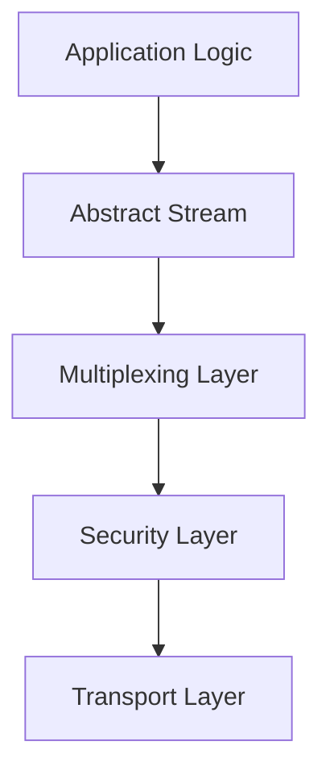

# Network Layer Overview: The "Pipe"

In NomadFS, the network layer is responsible for creating a secure, reliable, and multiplexed communication channel between peers. We call this the **"Pipe"**.

## 1. High-Level Architecture

The goal is to upgrade a raw, unreliable transport (like TCP) into a sophisticated peer-to-peer connection. We follow a layered approach:

### The Layers
1.  **Transport (TCP)**: The raw byte-stream provided by the operating system.
2.  **Security (Noise)**: Wraps TCP to provide mutual authentication and encryption.
3.  **Multiplexing (Yamux)**: Splits the single encrypted connection into many logical "streams".
4.  **Interface (Abstract Stream)**: Provides a generic `Read/Write` interface to the rest of the application.

## 2. Abstractions (`mod.zig`)

To decouple the application from the underlying network implementation, we use two primary interfaces:

### `ConnectionManager`
The central registry for all active connections.
*   **Purpose**: Pooling connections to avoid redundant handshakes and cleaning up idle resources.
*   **Methods**: `connectToPeer()`, `listen()`, `stop()`.

## 3. The Implementation Glue (`tcp.zig` & `manager.zig`)

The network layer coordinates several components to provide a seamless experience:
*   **Listening**: Accepts raw TCP connections and immediately triggers the [Noise Handshake](./noise.md).
*   **Connecting**: Dials a remote peer and initiates the handshake.
*   **Session Management**: Once the handshake is complete, it starts the [Yamux Session](./yamux.md) in a dedicated background thread.
*   **Lifecycle Control**: The [ConnectionManager](./management.md) runs a "Reaper" thread to prune dead or idle connections, ensuring system stability.

---

**Next Chapters:**
*   [Chapter 1.1: Security & The Noise Handshake](./noise.md)
*   [Chapter 1.2: Multiplexing with Yamux](./yamux.md)
*   [Chapter 1.3: Testing Network Logic](./testing.md)
