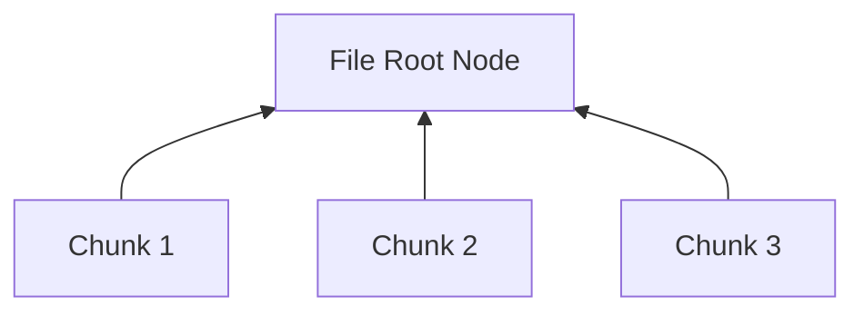

# Storage Layer Overview: The "Vault"

NomadFS doesn't store files as monolithic blobs. Instead, it uses a **Content-Addressed Storage** system based on **Merkle Directed Acyclic Graphs (DAGs)**.

## 1. Content Addressing & CIDs

In a traditional file system, you find a file by its path (e.g., `/home/user/photo.jpg`). In NomadFS, you find a file by its **Content Identifier (CID)**.

*   A CID is a cryptographic hash (e.g., BLAKE2b) of the file's contents.
*   **Property**: If the content changes, the CID changes. If two files have the exact same content, they have the exact same CID.
*   **Benefit**: This provides automatic **Deduplication**. If you have 10 copies of the same 1GB movie, NomadFS only stores it once.

## 2. Chunking & Blocks

Large files are split into smaller **Chunks** (typically 256 KB). Each chunk is hashed and stored as an immutable **Block**.

## 3. The Merkle DAG

A file in NomadFS is represented as a tree of hashes (a Merkle DAG). 
*   **Leaf Nodes**: Contain the raw data chunks.
*   **Internal Nodes**: Contain a list of CIDs (pointers) to their children.
*   **Root CID**: The hash of the root node becomes the "unique fingerprint" for the entire file.

This structure allows NomadFS to verify the integrity of a file efficiently. If even a single byte in a chunk is corrupted, the hash of that chunk will change, causing the parent's hash to change, all the way up to the root.

## 4. Local Storage Engine

The `storage/engine.zig` manages how these blocks are actually written to the disk. On a Full Node, this involves:
*   An indexed database (or flat-file structure) of CID -> Data.
*   Garbage collection for unreferenced blocks.
*   Encryption at rest (optional).

---

**Next Chapters:**
*   [Chapter 3.1: Chunking Strategies](./block.md)
*   [Chapter 3.2: Building the Merkle DAG](./dag.md)
*   [Chapter 3.3: The Disk Engine](./engine.md)
